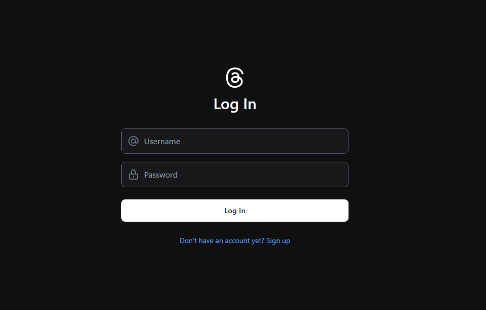
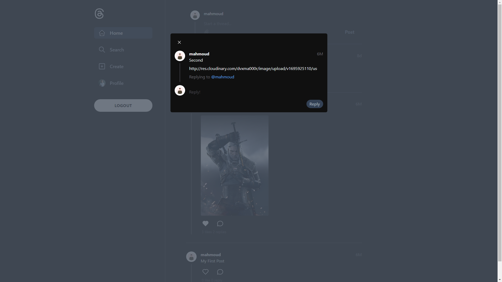
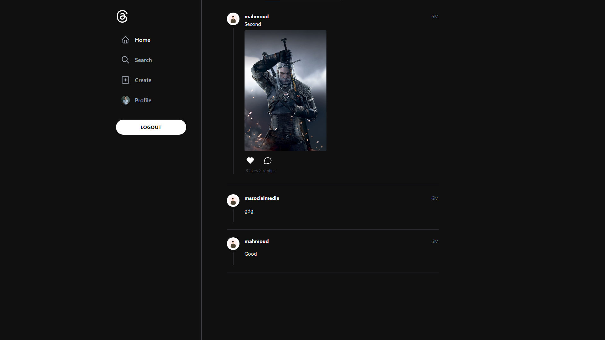

<a name="readme-top"></a>

<!-- PROJECT LOGO -->
<br />
<div align="center">
  <a href="https://github.com/Elalfy74/threads-client">
    
  </a>

  <h3 align="center">Threads Clone</h3>

  <p align="center">
   Threads clone built with Angular and Nest.js.
    <br />
    <br />
    <a href="">
    View Demo</a>
    ·
    <a href="https://threads-lac-omega.vercel.app">
    See Live</a>
  </p>
</div>

<!-- TABLE OF CONTENTS -->
<details>
  <summary>Table of Contents</summary>
  <ol>
    <li>
      <a href="#about-the-project">About The Project</a>
      <ul>
        <li><a href="#built-with">Built With</a></li>
        <li><a href="#features">Features</a>
          <ul>
            <li><a href="#authentication">Authentication</a></li>
            <li><a href="#server">Server</a></li>
            <li><a href="#client">Client</a></li>
          </ul>
        </li>
      </ul>
    </li>
    <li>
      <a href="#getting-started">Getting Started</a>
      <ul>
        <li><a href="#prerequisites">Prerequisites</a></li>
        <li><a href="#installation">Installation</a></li>
      </ul>
    </li>
    <li><a href="#contact">Contact</a></li>
  </ol>
</details>

<!-- ABOUT THE PROJECT -->

## About The Project

[![Threads Clone][product-screenshot]](https://threads-lac-omega.vercel.app)

- A simple full-stack built with Angular and Nest.js.
- Implemented NgRx as the state management tool for efficient data handling in the application.
- Integrated infinite scroll pagination using ngx-infinite-scroll to provide users with a seamless
  and continuous browsing experience.

<p align="right">(<a href="#readme-top">back to top</a>)</p>

### Built With


### Features

#### Authentication

The app's authentication system based on username and password powered by Nestjs JWT,
with preserve token and refresh token in httpOnly cookies.

Example: [Login](https://threads-lac-omega.vercel.app/auth)


#### Server

API is built nestjs with utilizing prisma as the database management tool. you can see the source code in [here](https://github.com/Elalfy74/threads-api).

- Authentication is done by passport and passport-jwt.
- The API is secured with JWT token and refresh token.
- The API has a auto refresh token system.
- The Api has a validation pipe to validate the input data built with class-validator and class-transformer.
- The API has a pagination system.
- The API has a documentation system with Swagger UI.

#### Client

Modern UI and experience similar to original Threads.

- Users can create new threads.
- User can upload images to threads.
- Users can reply to threads.
- Users can like and unlike threads.
- Utilize interceptors to add token to headers.
- Utilize infinite scroll pagination to load more threads.
- Utilize NgRx store to manage state management.




<p align="right">(<a href="#readme-top">back to top</a>)</p>

<!-- GETTING STARTED -->

## Getting Started

### Prerequisites

- Node.js
- npm or yarn

### Installation

1. Clone the repo
   ```sh
   git clone https://github.com/Elalfy74/threads-client
   ```
2. Install NPM packages
   ```sh
   yarn
   ```
3. Start the project
   ```sh
   ng serve
   ```

<p align="right">(<a href="#readme-top">back to top</a>)</p>

<!-- CONTACT -->

## Contact

Mahmoud Elalfy - [@Mahmoudelalfy74](https://twitter.com/Mahmoudelalfy74) -
[@Portfolio](https://mahmoud-elalfy.vercel.app/) -
[@LinkedIn](https://www.linkedin.com/in/mahmoud-elalfy-79b894209/)

Project Link: [Threads Clone](https://github.com/Elalfy74/threads-client)

<p align="right">(<a href="#readme-top">back to top</a>)</p>

[product-screenshot]: assets/images/screenshot.png
